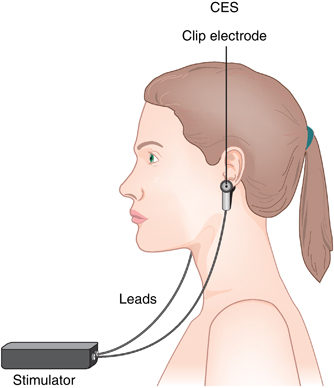

# CES-flpr0
Cranial Electrotherapy Stimulation using GPIO on Flpr0



## Setup for development/contribution

This app is built using [ufbt](https://pypi.org/project/ufbt/) - a subset of the flipper build tool (fbt) targeted at building apps. Install it with:

```bash
pip install ufbt
```

## See also

* [Flipper plugin documentation](https://github.com/flipperdevices/flipperzero-firmware/tree/dev/documentation)
